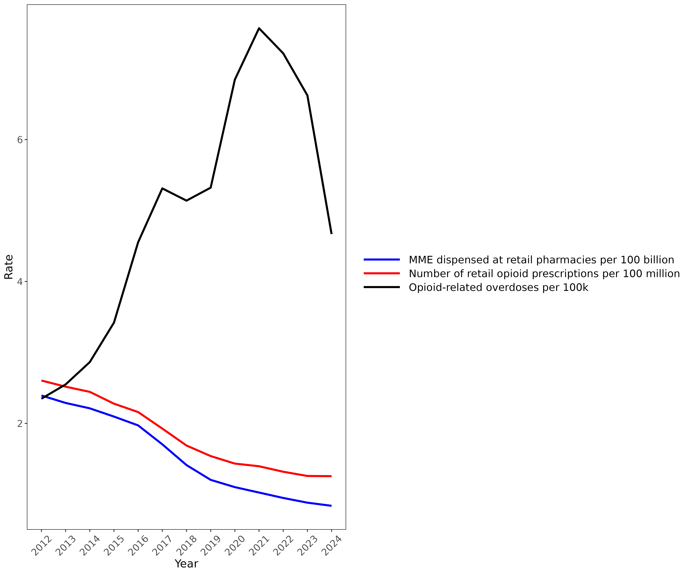
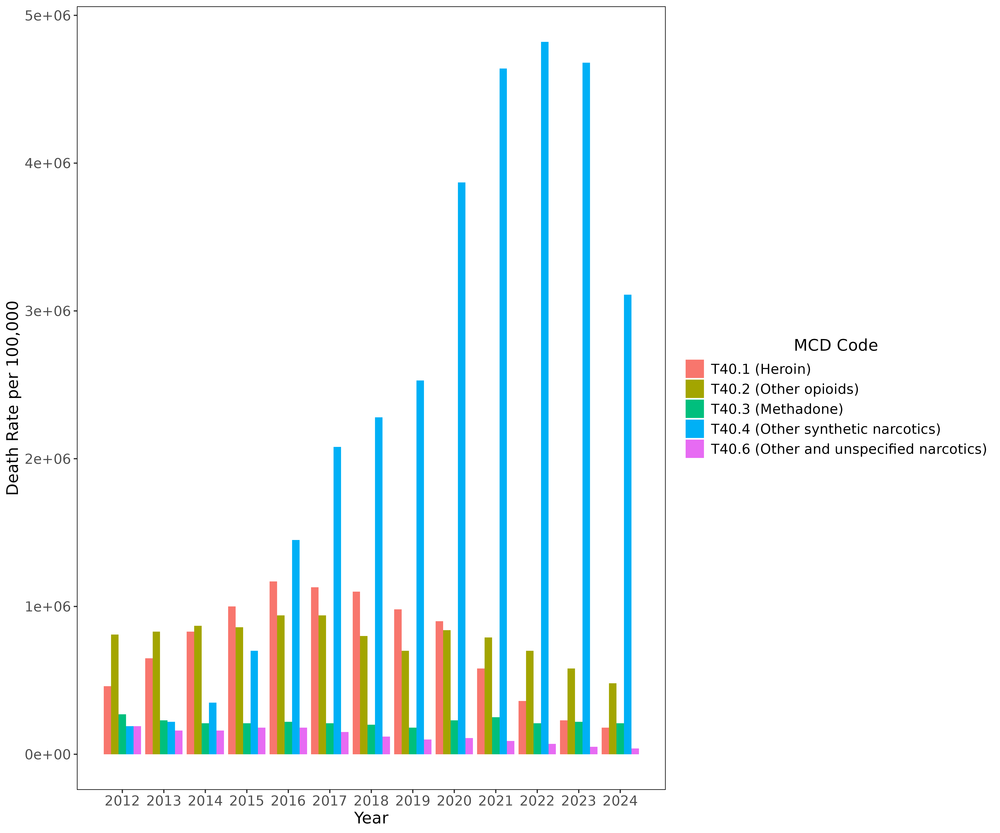

# A smorgasbord of overlooked aspects of the opioid epidemic

This repository contains instructions and R code for reproducing the figures presented in essay "A smorgasbord of overlooked aspects of the opioid epidemic" submitted to the Sensible Medicine Substack in April 2026.

Opioid-related Multiple Cause of Death (MCD) data was queried from the Centers for Disease Control and Prevention Wide-ranging ONline Data for Epidemiologic Research (CDC WONDER, [https://wonder.cdc.gov/mcd.html](https://wonder.cdc.gov/mcd.html)) database on 04/26/2026. Specifically, results were grouped by year, five-year age group, and MCD (T36-T65, T80-T88, T90-T98, X60-X84, Y40-Y84; note that not all MCD categories were used in generating the two figures). The retail opioid prescription data was pulled from the American Medical Association's website [https://www.ama-assn.org/system/files/opioid-prescription-by-state-trends.pdf](https://www.ama-assn.org/system/files/opioid-prescription-by-state-trends.pdf). The script generate_figures.R was used to generate the two figures.

  
   
  <em>Opioid overdose and prescription rates. Note that opioid overdose rate includes overdoses from all opioids, not necessarily prescription opioids.</em>

 

 

 

  
   
  <em>Opioid overdose rate per year grouped by ICD-10 classification.</em>

